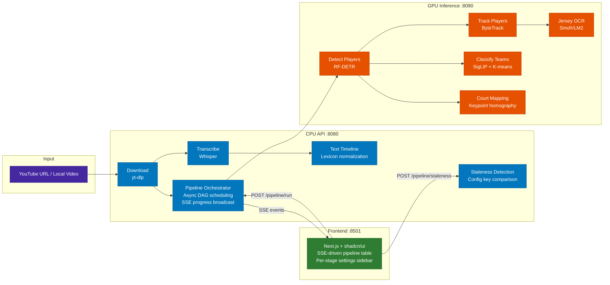

# BasketTube

[](./LICENSE)

AI-powered basketball game analysis — detect, track, and identify players using computer vision, with commentary-based insights via speech-to-text.

An [aegean.ai](https://aegean.ai/products/tech-demonstrators/sports-analytics) tech demonstrator.

## Architecture



## Quick Start

```bash
# 1. Set API keys
cp .env.example .env
# Edit .env: HF_TOKEN, ROBOFLOW_API_KEY

# 2. Start with GPU
docker compose --profile nvidia up -d

# 3. Open
# Frontend: http://localhost:8501
# API:      http://localhost:8080
```

## Containers

| Container | Port | Dockerfile | Purpose |
|-----------|------|------------|---------|
| `basket-tube-api` | 8080 | `Dockerfile.api` | CPU orchestrator — async pipeline scheduling, SSE, settings, staleness |
| `basket-tube-inference` | 8090 | `Dockerfile.gpu` | GPU inference — 5 vision model endpoints with progress file reporting |
| `basket-tube-frontend` | 8501 | `frontend/Dockerfile` | Next.js + shadcn/ui — SSE-driven pipeline UI with per-stage settings |
| `basket-tube-whisper` | 8000 | speaches image | Whisper STT (faster-whisper-medium) |

All containers run as non-root `appuser` (UID/GID from host). Shared `./pipeline_data` volume and `video_registry.yml` read-only.

## Async Pipeline Orchestrator

The CPU API runs a **fully asynchronous pipeline orchestrator** with dependency-aware parallelism and real-time progress via SSE:

1. Client calls `POST /api/pipeline/run/{video_id}` — returns `202 Accepted` immediately
2. Orchestrator schedules stages respecting the dependency DAG:
   - `detect` runs first
   - `track`, `classify-teams`, `court-map` run **concurrently** after detect
   - `ocr` runs after track completes
3. Each stage emits SSE events (`stage_started`, `stage_progress`, `stage_completed`, `stage_skipped`, `stage_error`)
4. GPU service writes atomic `_progress.json` files during frame processing; orchestrator polls every 2s and forwards as `stage_progress` events
5. Frontend receives events via `EventSource` and updates the pipeline table in real-time
6. **Broadcast EventBus** — append-only event log with per-subscriber cursors supports multiple tabs, browser refresh reconnect, and late-joining clients

**Key design properties:**
- **Non-blocking** — `asyncio.to_thread()` for yt_dlp, `httpx.AsyncClient` for Whisper, `httpx` for GPU calls
- **Config-key caching** — each parameter combination produces a unique output directory (`c-{hash}`); cached stages return `stage_skipped` instantly
- **Staleness detection** — `POST /api/pipeline/staleness/{video_id}` compares current settings against cached artifacts; frontend shows amber "Outdated" badge when settings change
- **Crash recovery** — stale "active" sidecars older than 600s are automatically cleared

## Pipeline Stages

| Stage | Endpoint | GPU Service | Output |
|-------|----------|-------------|--------|
| **Download** | `POST /api/download` | — (CPU) | `videos/{stem}.mp4` |
| **Transcribe** | `POST /api/transcribe/{id}` | Whisper :8000 | `transcriptions/whisper/{stem}.json` |
| **Text Timeline** | `POST /api/captions/timeline/{id}` | — (CPU) | `analysis/text_timeline/{config}/{stem}.json` |
| **Detect** | `POST /api/vision/detect/{id}` | `/api/detect` | `analysis/detections/{config}/{stem}.json` |
| **Track** | `POST /api/vision/track/{id}` | `/api/track` | `analysis/tracks/{config}/{stem}.json` |
| **Classify Teams** | `POST /api/vision/classify-teams/{id}` | `/api/classify-teams` | `analysis/teams/{config}/{stem}.json` |
| **OCR** | `POST /api/vision/ocr/{id}` | `/api/ocr` | `analysis/jerseys/{config}/{stem}.json` |
| **Court Map** | `POST /api/vision/court-map/{id}` | `/api/keypoints` | `analysis/court/{config}/{stem}.json` |

### Pipeline Endpoints

| Endpoint | Purpose |
|----------|---------|
| `POST /api/pipeline/run/{id}` | Start full pipeline (202 + SSE URL) |
| `POST /api/pipeline/run/{id}?from_stage=ocr` | Re-run from a specific stage |
| `POST /api/pipeline/cancel/{id}` | Cancel active pipeline |
| `GET /api/pipeline/events/{id}` | SSE event stream (with 15s keepalive) |
| `POST /api/pipeline/staleness/{id}` | Check which stages are outdated |
| `DELETE /api/vision/artifacts/{stage}/{id}` | Delete cached artifacts for re-run |
| `GET /api/vision/status/{id}` | Current status of all stages |

### Stage Dependencies

```
detect
  ├── track ──────────────┐
  │     └── ocr ──────────┤
  ├── classify-teams ──────┼──▶ render
  └── court-map ──────────┘
```

After detect completes, track + classify-teams + court-map run **in parallel**. OCR starts after track. Calling a stage without prerequisites returns HTTP 409.

## Frontend

Next.js 16 + React 19 + shadcn/ui with:

- **SSE-driven pipeline table** — real-time stage status, progress bars with frame percentages, elapsed timers
- **Per-stage action buttons** — Run/Re-run per stage (disabled while pipeline is active to prevent state corruption)
- **Per-stage settings dialog** — two-column sidebar layout (Foreign Whispers pattern) with model selectors, confidence sliders, and hyperparameter controls per stage
- **Staleness detection** — amber "Outdated" badge when cached artifacts don't match current settings (debounced 500ms check on settings change)
- **Settings persistence** — per-video settings saved to backend, with automatic migration from legacy flat format

## Per-Stage Settings

Each pipeline stage exposes configurable parameters in the settings dialog:

| Stage | Model Config | Parameters |
|-------|-------------|------------|
| **Transcribe** | Whisper variant | Use YouTube captions toggle |
| **Detect** | RF-DETR model ID | Confidence, IOU threshold |
| **Track** | ByteTrack (algorithmic) | IOU threshold, activation threshold, lost track buffer |
| **OCR** | VLM model ID | OCR interval (frames), consecutive reads threshold |
| **Teams** | SigLIP embedding model | Number of teams, crop scale, sampling stride |
| **Court Map** | Keypoint model ID | Keypoint confidence, anchor confidence |

## Project Structure

```
basket-tube/
├── api/src/                         # CPU API (FastAPI)
│   ├── main.py                      # App factory
│   ├── config.py                    # Settings (FW_ env prefix)
│   ├── artifacts.py                 # Config keys, paths, status sidecars, deletion
│   ├── video_registry.py            # video_registry.yml loader
│   ├── routers/
│   │   ├── pipeline.py              # Pipeline run, cancel, SSE events, staleness
│   │   ├── vision.py                # 6 vision stage endpoints + status + DELETE
│   │   ├── download.py              # POST /api/download (async via to_thread)
│   │   ├── transcribe.py            # POST /api/transcribe/{id} (async httpx)
│   │   ├── captions.py              # POST /api/captions/timeline/{id}
│   │   └── settings.py              # GET/PUT per-video settings with migration
│   ├── schemas/
│   │   ├── pipeline.py              # Pipeline run/cancel/event models
│   │   ├── vision.py                # Stage request/response models
│   │   └── settings.py              # Stage-keyed settings + flat→keyed migration
│   └── services/
│       ├── pipeline_orchestrator.py  # Async DAG scheduler + progress polling
│       ├── event_bus.py              # Broadcast SSE bus (append-only + cursors)
│       ├── vision_service.py         # HTTP client to GPU service
│       ├── whisper_service.py        # Async Whisper HTTP client (httpx)
│       └── text_timeline_service.py  # Basketball lexicon normalization
├── basket_tube/                      # GPU inference package
│   └── inference/
│       ├── main.py                   # FastAPI app (5 endpoints + progress writes)
│       ├── progress.py               # Atomic _progress.json writer
│       ├── roboflow/models.py        # RF-DETR, keypoints, OCR model loading
│       └── vision/
│           ├── tracker.py            # SAM2Tracker / ByteTrack
│           └── classifier.py         # TeamClassifier (SigLIP + K-means)
├── frontend/                         # Next.js + shadcn/ui
│   └── src/
│       ├── app/                      # Next.js App Router
│       ├── components/
│       │   ├── analysis-layout.tsx   # Main layout + pipeline wiring
│       │   ├── pipeline-table.tsx    # Stage table + action buttons + progress bars
│       │   ├── pipeline-status-bar.tsx # Live status with % progress
│       │   ├── settings-dialog.tsx   # Per-stage sidebar settings
│       │   ├── players-table.tsx     # Identified players roster
│       │   ├── court-view.tsx        # Bird's-eye court visualization
│       │   └── ...
│       ├── hooks/
│       │   ├── use-pipeline.ts       # SSE-driven pipeline state machine
│       │   ├── use-sse.ts            # EventSource hook (direct to API)
│       │   └── use-staleness.ts      # Debounced staleness check
│       ├── contexts/
│       │   └── analysis-settings-context.tsx  # Stage-keyed settings provider
│       └── lib/
│           ├── api.ts                # Fetch wrappers + pipeline/staleness calls
│           ├── types.ts              # Stage settings, staleness, pipeline types
│           └── stage-deps.ts         # Dependency graph + cascade computation
├── notebooks/                        # Jupyter notebooks
├── pipeline_data/api/                # All artifacts (volume-mounted)
├── video_registry.yml                # Video catalog
├── Dockerfile.api                    # CPU API image (non-root appuser)
├── Dockerfile.gpu                    # GPU inference image (non-root appuser)
└── docker-compose.yml                # 4 services (api, inference, frontend, whisper)
```

## Observability

Traces and spans are sent to Pydantic Logfire at https://logfire-us.pydantic.dev/pantelis/basket-tube

Instrumented spans:
- `pipeline.run` — full pipeline execution (parent span)
- `pipeline.stage.{name}` — individual stage spans
- `gpu.{stage}` — GPU service HTTP calls
- `whisper.transcribe` — Whisper STT calls
- `pipeline.download` — Video download
- `pipeline.timeline` — Text timeline construction

## Development

```bash
# Run tests
uv run pytest tests/ -v

# Rebuild after dependency changes
docker compose --profile nvidia build
docker compose --profile nvidia up -d

# Tail logs
docker compose --profile nvidia logs -f

# Stop
docker compose --profile nvidia down
```

### Environment Variables

| Variable | Container | Purpose |
|----------|-----------|---------|
| `HF_TOKEN` | GPU | Hugging Face token (model downloads) |
| `ROBOFLOW_API_KEY` | GPU | Roboflow API key |
| `INFERENCE_MODE` | GPU | `local` (GPU) or `remote` (Roboflow cloud) |
| `FW_INFERENCE_GPU_URL` | API | GPU service URL (default `http://localhost:8090`) |
| `FW_WHISPER_API_URL` | API | Whisper service URL (default `http://localhost:8000`) |
| `FW_LOGFIRE_WRITE_TOKEN` | API | Pydantic Logfire write token |

### Requirements

- Python 3.11
- NVIDIA GPU + CUDA 12.8 (for GPU inference)
- Docker + Docker Compose
- Node.js 20+ (for frontend development)
