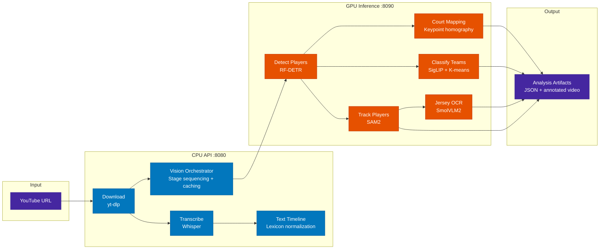

# BasketTube

[](./LICENSE)

AI-powered basketball game analysis — detect, track, and identify players using computer vision, with commentary-based insights via speech-to-text.

An [aegean.ai](https://aegean.ai/products/tech-demonstrators/sports-analytics) tech demonstrator.

## Architecture



## Quick Start

```bash
# 1. Set API keys
cp .env.example .env
# Edit .env: HF_TOKEN, ROBOFLOW_API_KEY

# 2. Start with GPU
docker compose --profile nvidia up -d

# 3. Open
# API:      http://localhost:8080
# Notebook: http://localhost:8888
```

## Containers

| Container | Port | Dockerfile | Purpose |
|-----------|------|------------|---------|
| `basket-tube-api` | 8080 | `Dockerfile.api` | CPU orchestrator — download, transcribe, vision routing, captions |
| `basket-tube-inference` | 8090 | `Dockerfile.gpu` | GPU inference — all 5 vision model endpoints |
| `basket-tube-notebook` | 8888 | `Dockerfile.gpu` | JupyterLab for prototyping (reuses GPU image) |

All containers share `./pipeline_data` via Docker volume and `video_registry.yml` read-only.

## API Orchestration Model

The CPU API orchestrates the vision pipeline **synchronously per request**:

1. Client calls a stage endpoint (e.g. `POST /api/vision/detect/{video_id}`)
2. CPU API checks if cached output exists → returns `skipped: true` immediately if so
3. CPU API writes an "active" status sidecar to prevent duplicate runs
4. CPU API makes a single `await httpx.post()` to the GPU service at `:8090` — async I/O (non-blocking for other FastAPI requests) but the client waits for the response
5. GPU service processes all video frames, writes result JSON atomically (`.tmp` + rename)
6. CPU API writes "complete" status sidecar and returns the response

**Key design decisions:**
- **No background task queue** — each request is synchronous from the client's perspective
- **Stages are independent** — the client decides when to call the next stage, not the API
- **Config-key namespacing** — each parameter combination produces a unique output directory (`c-{hash}`), so changing confidence or swapping models never returns stale results
- **Crash recovery** — stale "active" sidecars older than 600s are automatically cleared

## Pipeline Stages

| Stage | Endpoint | GPU Service | Output |
|-------|----------|-------------|--------|
| **Download** | `POST /api/download` | — (CPU) | `videos/{stem}.mp4` |
| **Transcribe** | `POST /api/transcribe/{id}` | — (CPU, Whisper) | `transcriptions/whisper/{stem}.json` |
| **Text Timeline** | `POST /api/captions/timeline/{id}` | — (CPU) | `analysis/text_timeline/{config}/{stem}.json` |
| **Detect** | `POST /api/vision/detect/{id}` | `/api/detect` | `analysis/detections/{config}/{stem}.json` |
| **Track** | `POST /api/vision/track/{id}` | `/api/track` | `analysis/tracks/{config}/{stem}.json` |
| **Classify Teams** | `POST /api/vision/classify-teams/{id}` | `/api/classify-teams` | `analysis/teams/{config}/{stem}.json` |
| **OCR** | `POST /api/vision/ocr/{id}` | `/api/ocr` | `analysis/jerseys/{config}/{stem}.json` |
| **Court Map** | `POST /api/vision/court-map/{id}` | `/api/keypoints` | `analysis/court/{config}/{stem}.json` |
| **Render** | `POST /api/vision/render/{id}` | — (CPU, stub) | `analysis/renders/{config}/{stem}.mp4` |
| **Status** | `GET /api/vision/status/{id}` | — | Pipeline stage status |

### Stage Dependencies

```
detect (1)
  ├── track (2) ──────────┐
  │     └── ocr (4) ──────┤
  ├── classify-teams (3) ──┼──▶ render (6)
  └── court-map (5) ──────┘
```

Stages 2, 3, 5 can run after 1. Stage 4 (OCR) needs tracks for temporal validation. Calling a stage without its prerequisites returns HTTP 409.

## Project Structure

```
basket-tube/
├── api/src/                         # CPU API (FastAPI)
│   ├── main.py                      # App factory
│   ├── core/
│   │   ├── config.py                # Settings (FW_ env prefix)
│   │   ├── artifacts.py             # Config keys, paths, status sidecars
│   │   └── video_registry.py        # video_registry.yml loader
│   ├── routers/
│   │   ├── download.py              # POST /api/download
│   │   ├── transcribe.py            # POST /api/transcribe/{id}
│   │   ├── vision.py                # 6 vision stage endpoints + status
│   │   └── captions.py              # POST /api/captions/timeline/{id}
│   ├── schemas/                     # Pydantic models
│   └── services/                    # Business logic
│       ├── vision_service.py        # HTTP client to GPU service
│       └── text_timeline_service.py # Basketball lexicon normalization
├── basket_tube/                     # GPU inference package
│   └── inference/
│       ├── main.py                  # FastAPI app (all 5 endpoints)
│       ├── roboflow/models.py       # RF-DETR, keypoints, OCR model loading
│       └── vision/
│           ├── tracker.py           # SAM2Tracker
│           └── classifier.py        # TeamClassifier wrapper
├── notebooks/                       # Jupyter notebooks
├── frontend/                        # Next.js + shadcn/ui (to be wired)
├── pipeline_data/api/               # All artifacts (volume-mounted)
│   ├── videos/                      # Source MP4s
│   ├── youtube_captions/            # yt-dlp caption JSON
│   ├── transcriptions/whisper/      # Whisper output
│   └── analysis/                    # Vision pipeline outputs
│       ├── detections/{config}/     # RF-DETR per-frame boxes
│       ├── tracks/{config}/         # SAM2 masks + tracker IDs
│       ├── teams/{config}/          # Team assignments + palette
│       ├── jerseys/{config}/        # Validated jersey numbers
│       ├── court/{config}/          # Court coordinates
│       ├── renders/{config}/        # Annotated videos
│       └── text_timeline/{config}/  # Normalized caption segments
├── video_registry.yml               # Video catalog
├── Dockerfile.api                   # CPU API image
├── Dockerfile.gpu                   # GPU inference image (+ notebook)
└── docker-compose.yml               # 3 services
```

## Development

```bash
# Run tests
uv run pytest tests/ -v

# Rebuild after dependency changes
docker compose --profile nvidia build
docker compose --profile nvidia up -d

# Tail logs
docker compose --profile nvidia logs -f

# Stop
docker compose --profile nvidia down
```

### Environment Variables

| Variable | Container | Purpose |
|----------|-----------|---------|
| `HF_TOKEN` | GPU | Hugging Face token (model downloads) |
| `ROBOFLOW_API_KEY` | GPU | Roboflow API key |
| `INFERENCE_MODE` | GPU | `local` (GPU) or `remote` (Roboflow cloud) |
| `FW_INFERENCE_GPU_URL` | API | GPU service URL (default `http://localhost:8090`) |
| `FW_WHISPER_MODEL` | API | Whisper model size (default `base`) |

### Requirements

- Python 3.11
- NVIDIA GPU + CUDA 12.8 (for GPU inference)
- Docker + Docker Compose
- ffmpeg
